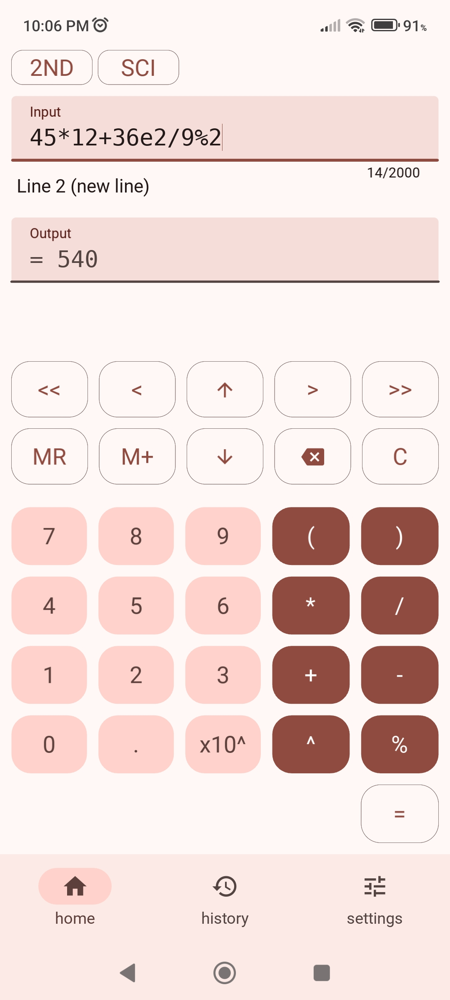
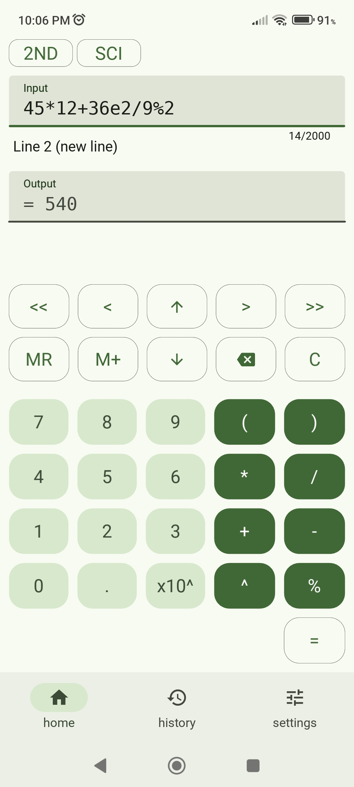
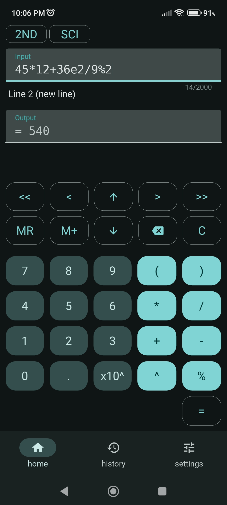
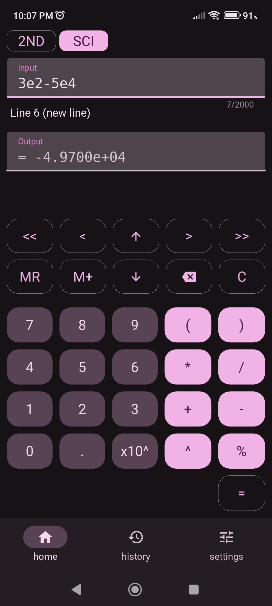
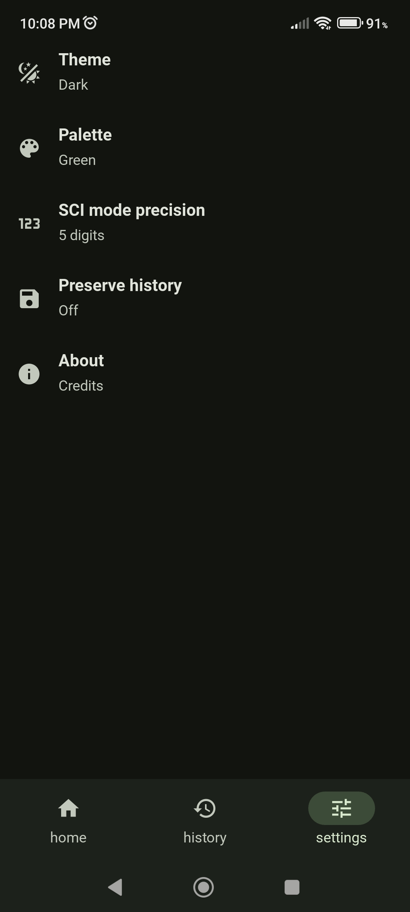
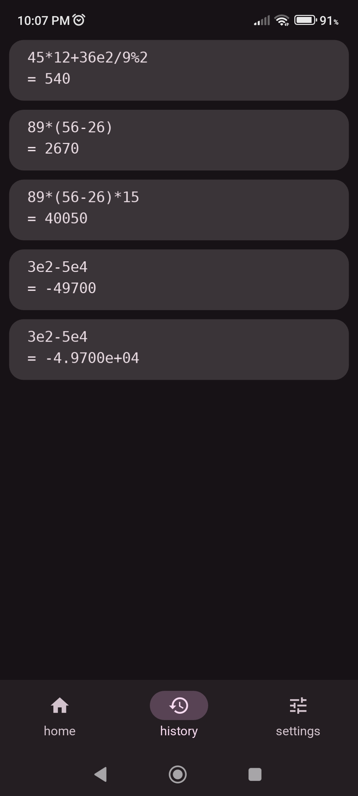

# kivycalc
Simple but hopefully useful calculator using Python, Kivy and KivyMD.

It aims to be feature-packed while remaining easy-to-use.


# Features
- 👕 Google's Material Design UI
- 🔆🌙 Light and dark themes
- 🎨 Accent colors
- 📕 Long-text input support (currently up to 2000 characters because of a visual bug, but surely will be upgraded in the future)
- 🔢 Standard operations supported: +,-,*,/,^,% (sqrt, logarithms and trigonometric functions will be added soon)
- 👨‍💻 Configurable parser (it's designed so you can easily add operators to the parser and create new functions)
- 📜 History lookup mode, where you can easily switch between previous expressions
- 🪧 History stand, where you can look at all operations made
- 👩‍🔬 Scientific mode and powers-of-10 notation (for example, type 2.5e5 for 2.5*10^5) 
- 🧠 Classic memory management functions: M+, M-, MR, MS

# Screenshots

<table>
	<tr>
		<td></td>
		<td></td>
		<td></td>
	</tr>
	<tr>
		<td></td>
		<td></td>
		<td></td>
	</tr>
</table>

# Installation

## From releases tab
You can download the apk!

## From source
Requisites: 
- ```python3``` and ```pip```
- ```gradle``` (latest version recommended)
- ```openjdk 21``` or later
- ```adb``` for streamed installations

### Steps
1. Clone the repository locally

```bash
git clone https://github.com/Rigel2118/kivycalc.git
cd kivycalc/
```
2. Install Kivy and KivyMD

```bash
pip install kivy https://github.com/kivymd/KivyMD/archive/master.zip
```

3. Configure buildozer by following the instructions in https://buildozer.readthedocs.io/en/latest/installation.html 

Notes
- ```cython 0.29.33``` is recommended
- buildozer.spec is already configured

4. Compile it

```bash
buildozer android debug
```

5. Install it in your phone via USB debugging
```bash
adb install bin/name_of_the_file.apk
```

# How to use
I will assume you already know how to use a calculator, so I only mention feature-specific stuff.

- There are 3 tabs: home, history and settings. The history tab contains a stand of cards with every calculation you made.
- Every time you make a calculation by pressing "=", a new entry in the history stand is added, as well as a new line below the input field. A new line is always appended at the bottom (largest number). You can browse the history by pressing the up and down arrows of the upper keyboard. If it says "history lookup" it means you are browsing previous calculations, and they temporarily replace whatever you had in the input field. If it says "new line" it means you are doing a new calculation.
- Writing while on history-lookup mode overrides what you have in new line.
- You can also go back to a previous calculation by pressing any card on the history stand.
- You can switch between a first and second sets of functions by pressing the "2ND" button.
- Press the "SCI" button to turn on output in scientific notation.
- You can write powers of 10 any time by using the button "x10^". This is independent of SCI mode.
- Use MS to save the result in storage.
- Use MR to recall the saved value in input.
- Use M+ to add the result to the saved value.
- Use M- to substract the result to the saved value.
- "C" clears the input.
- "AC" clears the input and the history stand.
- In the settings tab, you can configure theme, palette, scientific mode precision and whether or not to preserve history on reboot.
- By design, the parser accepts multiple successive signs like "+++--", which is treated as a sign product, for instance, "(+)(+)(+)(-)(-)".
- Any errors during parsing are presented in the output field.
- Powers-of-10 doesn't support decimal exponents, only integers. 

# Bugs and suggestions
Please open an issue or send me an email to axiomtools360@gmail.com.
